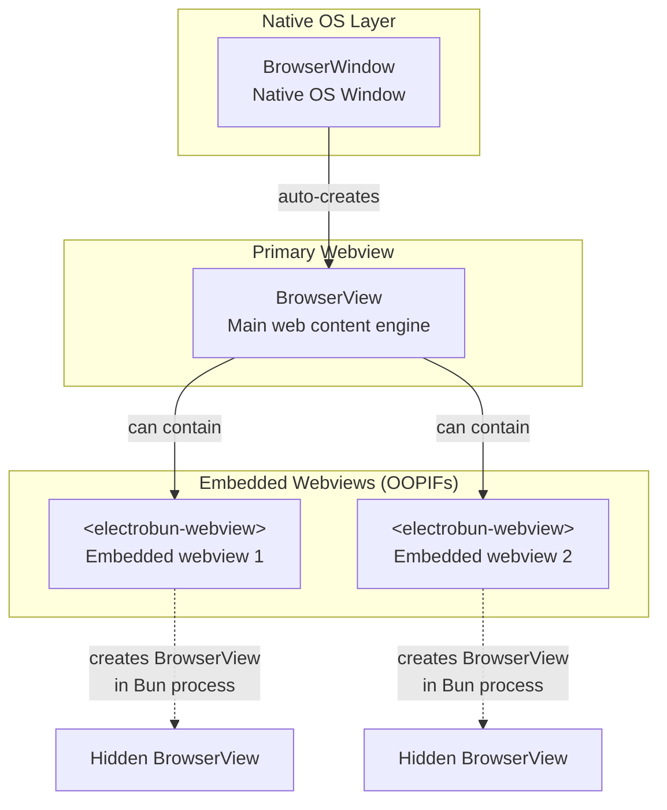

# ElectroBun Framework Deep Dive

## Multi-Process Architecture

ElectroBun uses a **layered multi-process model**:

### 1. Main Process (Bun Runtime)
- Runs your application logic in `src/main/index.ts`
- Manages windows, menus, tray, and system integration
- Handles file system access, git operations, terminals
- Uses **GoldfishDB** for encrypted local persistence

### 2. Native Layer (Zig/Objective-C)
- Bridges JavaScript ↔ Native OS APIs
- Window management (`NSWindow` on macOS)
- Webview creation (`WKWebView` or CEF)
- Message handlers (`bunBridge`, `internalBridge`)

### 3. Renderer Process (Browser Context)
- Web content running in webviews
- **Electroview** class manages browser-side RPC
- Can use any frontend framework (SolidJS in Colab)

---

## RPC Communication System

ElectroBun uses the `rpc-anywhere` library for type-safe communication:

### Transport Mechanisms

| Transport | Use Case |
|-----------|----------|
| **WebSocket** | Bun ↔ Webview (primary, encrypted AES-GCM) |
| **Standard I/O** | Bun ↔ Zig native layer |
| **Named Pipes** | Inter-process communication |
| **`postMessage`** | Fallback browser communication |

### Schema Definition Pattern

```typescript
// In renderer (e.g., rpc.ts)
export type WorkspaceRPC = {
  bun: RPCSchema<{
    requests: {
      getInitialState: { params: void; response: any };
      writeFile: { 
        params: { path: string; value: string }; 
        response: { success: boolean; error?: string } 
      };
      // ... more methods
    };
    messages: {
      // One-way messages from renderer to main
    };
  }>;
  webview: RPCSchema<{
    // Messages from main to renderer
    messages: {
      fileChanged: { path: string; content: string };
    };
  }>;
};
```

---

## Key API Components

> [!IMPORTANT]
> **Understanding the Hierarchy**: `BrowserWindow` → `BrowserView` → `<electrobun-webview>`

### Relationship Diagram



---

### BrowserWindow
**What it is**: A native operating system window (like `NSWindow` on macOS).

**When to use**: Create new top-level windows for your app (main window, settings, about dialogs).

**Key point**: Each `BrowserWindow` automatically creates a primary `BrowserView` to display content.

```typescript
import { BrowserWindow } from "electrobun";

const win = new BrowserWindow({
  title: "My App",
  frame: { width: 1200, height: 800, x: 100, y: 100 },
  url: "views://index.html"  // Use views:// protocol for bundled content
});

// Access the auto-created webview
win.webview.loadURL("https://example.com");
```

---

### BrowserView
**What it is**: The web content engine (webview) - controlled from the Bun process.

**When to use**: Programmatic control over web content (load URLs, execute JS, listen to events).

**Key point**: You typically access this via `BrowserWindow.webview`, not create it directly.

```typescript
// Usually accessed through a window:
win.webview.loadURL("https://example.com");
win.webview.executeJavaScript("console.log('Hello')");

// Can choose renderer engine:
const win = new BrowserWindow({
  url: "views://index.html",
  renderer: "cef"  // "native" (WKWebView) or "cef" (Chromium)
});
```

---

### `<electrobun-webview>` Tag
**What it is**: A custom HTML element to embed webviews *inside* another webview.

**When to use**: Build complex layouts with isolated webview regions (like browser tabs within your app, or isolated third-party content).

**Key point**: Creates Out-of-Process IFrames (OOPIFs) - each embedded webview runs in its own process for security/isolation. Behind the scenes, it creates a `BrowserView` in the Bun process.

```html
<!-- In your renderer HTML -->
<electrobun-webview 
  src="https://example.com" 
  preload="my-preload.js"
  renderer="cef"
  style="width: 100%; height: 400px;">
</electrobun-webview>
```

| Attribute | Description |
|-----------|-------------|
| `src` | URL to load |
| `preload` | Script to inject before page loads |
| `renderer` | `"native"` or `"cef"` |
| `partition` | Storage partition for isolation |

---

### Summary Table

| Component | Layer | Created By | Purpose |
|-----------|-------|------------|---------|
| **BrowserWindow** | Native OS | Your code | Top-level window |
| **BrowserView** | Bun process | BrowserWindow or electrobun-webview | Webview engine |
| **`<electrobun-webview>`** | Renderer HTML | Your HTML | Embed isolated webviews |

---

### ApplicationMenu
System menu bar:
```typescript
import { ApplicationMenu } from "electrobun";

ApplicationMenu.setMenus([
  { label: "File", submenu: [
    { label: "New", accelerator: "cmd+n", action: "new-file" }
  ]}
]);

ApplicationMenu.on("application-menu-clicked", (e) => {
  if (e.data.action === "new-file") { /* handle */ }
});
```

### Electroview (Browser-side)
```typescript
import Electroview from "electrobun/view";

// Send request to main process
const state = await Electroview.rpc.request.getInitialState();

// Subscribe to messages from main
Electroview.rpc.addMessageHandler("fileChanged", (data) => {
  console.log("File changed:", data.path);
});
```

---

## electrobun.config.ts

The main configuration file:

```typescript
export default {
  app: {
    name: "My App",
    identifier: "com.example.myapp",  // Bundle ID
    version: "1.0.0"
  },
  build: {
    bun: {
      entrypoint: "src/main/index.ts",  // Main process entry
      external: []  // Packages to exclude from bundling
    },
    views: {
      // Build steps for renderer views (esbuild)
    },
    copy: {
      // Files to copy to bundle
      "src/renderers/app/index.html": "views/app/index.html",
      "assets/": "views/assets/"
    },
    mac: {
      codesign: true,
      notarize: true,
      bundleCEF: true  // Include Chromium Embedded Framework
    }
  },
  scripts: {
    postBuild: "./scripts/postBuild.ts"
  },
  release: {
    bucketUrl: "https://releases.example.com/"
  }
};
```

---

## Resources

- **GitHub**: https://github.com/blackboardsh/electrobun
- **Docs**: Run `bun run docs:dev` in electrobun repo
- **Discord**: https://discord.gg/ueKE4tjaCE
