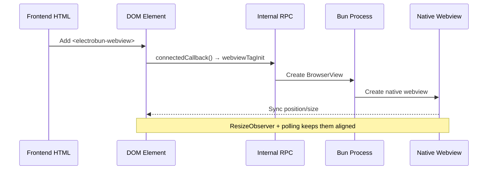

# The `<electrobun-webview>` Tag

> A detailed API reference for ElectroBun's custom webview element.

## Overview

The `<electrobun-webview>` tag is a **custom HTML element** that embeds a native webview directly in your frontend HTML. Unlike Electron/Tauri where webviews must be created from the backend, ElectroBun allows **declarative, frontend-driven** webview creation.

```html
<electrobun-webview 
  src="https://example.com" 
  renderer="cef"
  preload="injected-script.js"
  style="width: 100%; height: 400px;">
</electrobun-webview>
```

---

## How It Works



**Key insight**: The DOM element is a *positional anchor*. The actual rendering happens in a separate native process (OOPIF), synced to match the element's position.

---

## Attributes

| Attribute | Type | Description |
|-----------|------|-------------|
| `src` | string | URL to load in the webview |
| `html` | string | HTML content to load (alternative to `src`) |
| `preload` | string | JavaScript to inject before page scripts |
| `renderer` | `"native"` \| `"cef"` | Rendering engine (default: `"native"`) |
| `partition` | string | Storage isolation partition (see below) |
| `masks` | string | CSS selectors for elements that overlay the webview |

### Partition Values

| Value | Behavior |
|-------|----------|
| `null` or `""` | Default shared partition |
| `persist:myid` | Persistent storage, isolated by identifier |
| `temp:myid` | Ephemeral storage (cleared on close) |

---

## JavaScript Methods

Access via DOM reference:

```javascript
const webview = document.querySelector('electrobun-webview');
```

### Navigation

| Method | Description |
|--------|-------------|
| `loadURL(url: string)` | Navigate to URL |
| `loadHTML(html: string)` | Load HTML string |
| `goBack()` | Navigate back |
| `goForward()` | Navigate forward |
| `reload()` | Reload current page |

### JavaScript Execution

| Method | Description |
|--------|-------------|
| `executeJavaScript(code: string)` | Execute JS in webview (fire & forget) |
| `callAsyncJavaScript({ script: string })` | Execute JS and await return value |

```javascript
// Fire and forget
webview.executeJavaScript('document.body.style.background = "red"');

// Await result
const title = await webview.callAsyncJavaScript({ 
  script: 'return document.title' 
});
```

### Display Control

| Method | Description |
|--------|-------------|
| `toggleTransparent(transparent?: boolean)` | Toggle webview transparency |
| `sendMessage(name: string, data: any)` | Send message to webview |
| `dispatchEvent(type: string, detail: any)` | Dispatch custom event to webview |

---

## Events

Listen with standard `addEventListener`:

```javascript
webview.addEventListener('did-navigate', (e) => {
  console.log('Navigated to:', e.detail.url);
});
```

| Event | When Fired |
|-------|------------|
| `will-navigate` | Before navigation starts (cancellable) |
| `did-commit-navigation` | Navigation committed, page loading |
| `did-navigate` | Navigation complete |
| `did-navigate-in-page` | In-page navigation (hash, pushState) |
| `dom-ready` | Page DOM fully loaded |
| `new-window-open` | Webview requests new window |

---

## Dynamic Creation

```javascript
// Create dynamically
const webview = document.createElement('electrobun-webview');
webview.setAttribute('src', 'https://example.com');
webview.setAttribute('renderer', 'cef');
webview.style.cssText = 'width: 100%; height: 300px;';

// Add to DOM → webview created automatically
document.getElementById('container').appendChild(webview);

// Later: update URL
webview.loadURL('https://other-site.com');

// Or remove → webview destroyed
webview.remove();
```

---

## Masks (Overlay Elements)

When you need UI elements to appear *above* the webview:

```html
<electrobun-webview 
  src="https://example.com" 
  masks="#toolbar, .floating-menu">
</electrobun-webview>
<div id="toolbar">I appear above the webview</div>
```

The `masks` attribute lists CSS selectors. These elements create transparent "holes" in the native webview, allowing your HTML to show through.

---

## Comparison: Frontend vs Backend Webview Creation

| Aspect | `<electrobun-webview>` | `BrowserView` (Bun) |
|--------|------------------------|---------------------|
| **Created from** | Frontend HTML/JS | Backend Bun process |
| **Layout control** | CSS/HTML | Programmatic (x, y, width, height) |
| **Best for** | Embedded panels, dynamic UIs | System windows, backend-controlled |
| **State management** | Frontend framework | Backend logic |
| **IPC for UI changes** | Not needed | Required |

---

## Complete Example

```html
<!DOCTYPE html>
<html>
<head>
  <style>
    .browser-container {
      display: flex;
      flex-direction: column;
      height: 100vh;
    }
    .toolbar {
      padding: 8px;
      background: #333;
      display: flex;
      gap: 8px;
    }
    .toolbar button { padding: 4px 12px; }
    .toolbar input { flex: 1; padding: 4px 8px; }
    electrobun-webview {
      flex: 1;
      border: none;
    }
  </style>
</head>
<body>
  <div class="browser-container">
    <div class="toolbar">
      <button id="back">←</button>
      <button id="forward">→</button>
      <button id="reload">↻</button>
      <input id="url" value="https://example.com" />
      <button id="go">Go</button>
    </div>
    
    <electrobun-webview 
      id="browser"
      src="https://example.com"
      renderer="cef"
      masks=".toolbar">
    </electrobun-webview>
  </div>

  <script>
    const webview = document.getElementById('browser');
    const urlInput = document.getElementById('url');
    
    document.getElementById('back').onclick = () => webview.goBack();
    document.getElementById('forward').onclick = () => webview.goForward();
    document.getElementById('reload').onclick = () => webview.reload();
    document.getElementById('go').onclick = () => webview.loadURL(urlInput.value);
    
    webview.addEventListener('did-navigate', (e) => {
      urlInput.value = e.detail.url;
    });
  </script>
</body>
</html>
```
